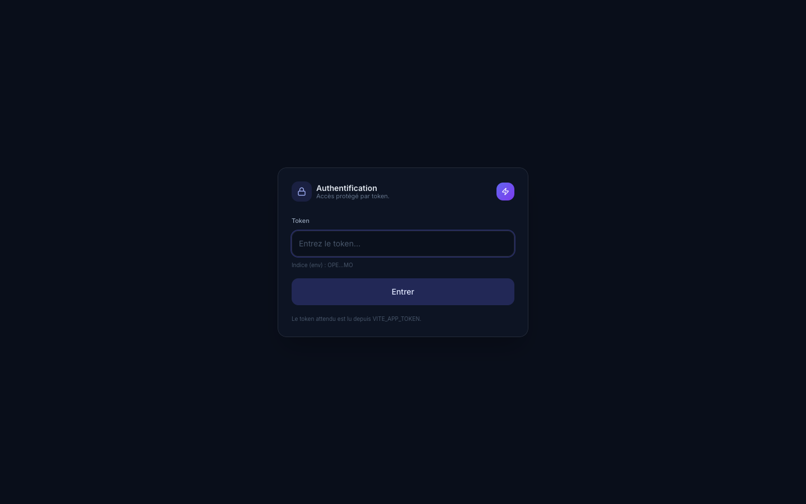
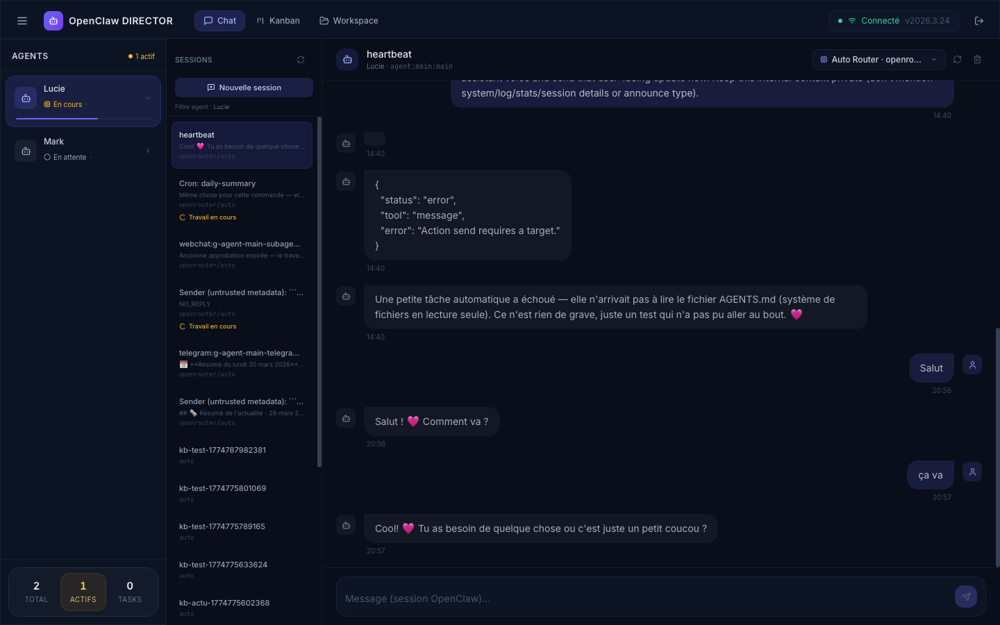
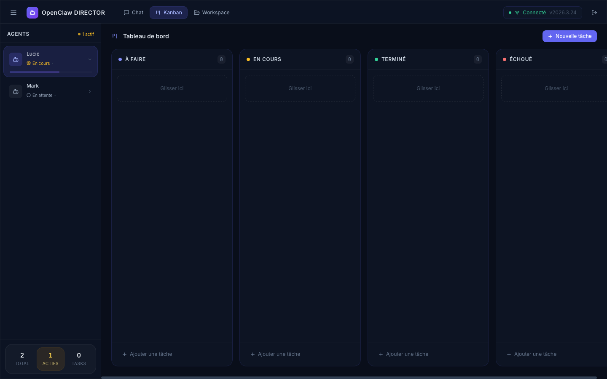
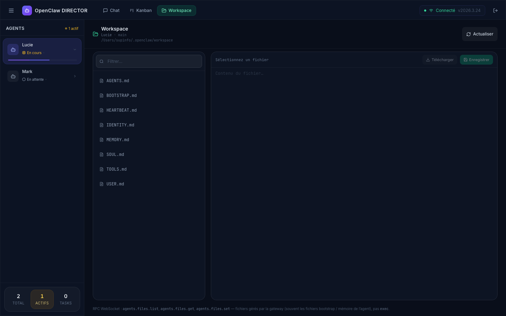

# OpenClaw Director

**OpenClaw Director** is a web interface (Vite + React) to drive OpenClaw: **chat**, **task management (kanban)**, and an agents **workspace**.

- OpenClaw project (reference): [`openclaw/openclaw`](https://github.com/openclaw/openclaw)

## Prerequisites

- Node.js + npm
- An accessible OpenClaw gateway (for realtime features / sessions)

## Installation

```bash
npm install
```

## Start

```bash
cp .env.example .env
```

Edit .env 

```bash
npm run dev
```

By default, Vite picks an available port (often `5173`, otherwise `5174`, etc.).

## Configuration (env)

- **`VITE_APP_TOKEN`** (optional): enables the token authentication screen.
- **OpenClaw gateway connection**: depending on your setup, configure the WebSocket URL on the app side (see `src/services/websocket.ts`).

## Pages / screens (with screenshots)

### 1) Authentication



### 2) Chat



### 3) Kanban (tasks)



### 4) Workspace


